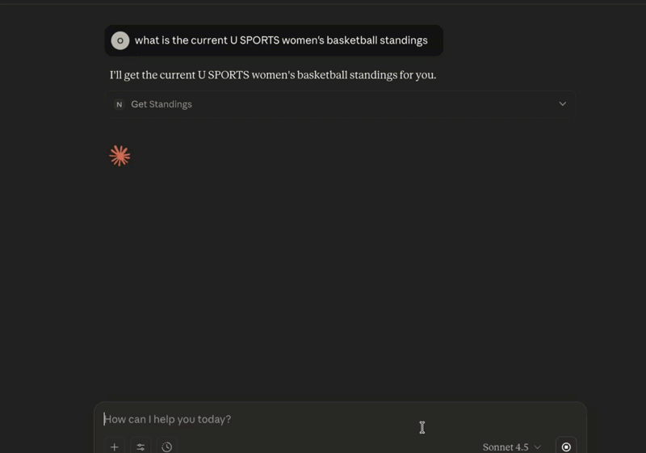

# Northscore MCP Server

> **This is an early demo/prototype.** The server is functional but still under active development.


<a href="https://modelcontextprotocol.io/clients" target="_blank"></a>

MCP (Model Context Protocol) server for [**Northscore**](https://www.northscore.ca).



*Demo showing Claude Code using the Northscore MCP — fetching league standings, then following up to get the top scorer using the same conversation context.*

Built with TypeScript following [MCP TypeScript SDK](https://github.com/modelcontextprotocol/typescript-sdk) and [OpenAI Apps SDK](https://developers.openai.com/apps-sdk) standards.

## Overview

The Northscore MCP Server enables AI agents to query Northscore's sports data securely — 7 tools covering 10 Canadian league families (CEBL, CFL, CPL, HoopQueens, NSL, MWBA, CHL, U SPORTS, OCAA, PSL), served over **stdio** (local clients like Claude Desktop) and **Streamable HTTP** (remote hosts like ChatGPT and Claude web).

### Tools

| Tool | Purpose |
|---|---|
| `get_games_by_date` | Cross-league games for today / this week / a date range |
| `get_games` | Single-league schedule and scores |
| `get_standings` | League standings |
| `get_leaderboard` | Top stat leaders |
| `get_team_info` | Team record, division, streak |
| `get_team_stats` | Team statistics |
| `get_team_roster` | Team roster |

Each tool exposes only the leagues its endpoint actually supports (per-tool enums) — see [CLAUDE.md](./CLAUDE.md) for the full coverage matrix.

## Documentation

Project context, tool definitions, and architecture live in [CLAUDE.md](./CLAUDE.md). Future plans are in [ROADMAP.md](./ROADMAP.md). External references:

- [MCP Apps overview](https://modelcontextprotocol.io/extensions/apps/overview) and [build guide](https://modelcontextprotocol.io/extensions/apps/build)
- [OpenAI Apps SDK — MCP Apps in ChatGPT](https://developers.openai.com/apps-sdk/mcp-apps-in-chatgpt)
- [MCP Inspector](https://modelcontextprotocol.io/docs/tools/inspector) for local debugging

## Prerequisites

- Node.js >= 22.17.0
- **pnpm** >= 10.0.0 ([Installation Guide](https://pnpm.io/installation))
- TypeScript >= 5.0.0

This project uses `pnpm` as the package manager.

## Quick Setup

1. **Install dependencies:**

   ```bash
   pnpm install
   ```

2. **Configure environment:**

   ```bash
   cp .env.example .env
   ```

   Edit `.env` and add your Northscore API key:

   ```env
   NORTHSCORE_STATS_API_KEY=your_api_key_here
   ```

3. **Run the server:**
   ```bash
   pnpm dev
   ```

## Development

```bash
pnpm dev          # Run with hot reload
pnpm build        # Compile TypeScript
pnpm start        # Run compiled version
pnpm type-check   # Type checking
pnpm lint         # Run ESLint
pnpm format       # Format code with Prettier
pnpm test         # Run tests (Vitest)
```

### Debugging with MCP Inspector

```bash
npx @modelcontextprotocol/inspector node dist/index.js
```

## References

- [Model Context Protocol SDK](https://github.com/modelcontextprotocol/typescript-sdk)
- [OpenAI Apps SDK](https://developers.openai.com/apps-sdk)
